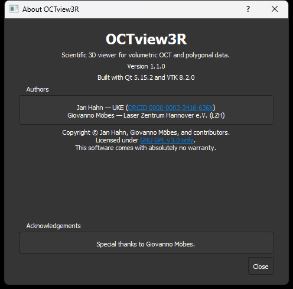

# OCTview3R

OCTview3R is a Windows desktop application for interactive visualization of
volumetric image data and polygonal data sets. It is written in C++ and uses
Qt for the user interface and VTK for data processing and 3D rendering.

The repository contains the application sources, Qt Designer forms, icons,
and a small collection of example data sets. The included TIFF volumes are
OCT scans of a cherry and contain no human or clinical data.

## Screenshots


*Volume rendering of the included non-medical cherry OCT data set. The viewer
is shown with the optional dark interface theme, dataset metadata, rendering
controls, transform settings, and crop ranges.*

<p align="center">
  
</p>

<p align="center"><em>Version, authorship, licensing, and acknowledgements in the About dialog.</em></p>

## Features

- Volume rendering for RAW, TIFF, JPEG stack, and legacy VTK image data
- Polygonal and point-data import for VTK, STL, PLY, VTP, OBJ, BYU (`.g`),
  VTR, and XYZ files
- Maximum-intensity, composite, additive, and minimum-intensity blend modes
- Threshold, opacity, color-transfer, and polygonal gloss controls
- Per-axis range cropping for volume and polygonal data
- Interactive image plane with optional median filtering and clipping
- Multiple data sets in closable, filename-based tabs
- Per-object translation, rotation, and axis scaling
- Editable transform and crop tables with full-range reset
- Camera presets, fit-selected/all, perspective/orthographic projection,
  orientation marker, scalar bar, and cube axes
- System, light, and dark interface themes
- Dataset metadata for volume dimensions, spacing, scalar type, mesh bounds,
  and geometry counts
- Automatic surface display and generated normals for polygonal meshes
- Incremental VTK updates for appearance, transform, crop, and plane changes
- TIFF export of the current render window

Window layout, interface theme, viewer background, camera options, and the
last-used volume and PolyData directories are restored on the next start.

## Requirements

The current project configuration targets the following toolchain:

- Windows x64
- Visual Studio 2022 with the MSVC v143 toolset
- Windows 10 SDK
- Qt 5.15.2 for `msvc2019_64`
- Qt Visual Studio Tools / Qt MSBuild integration
- VTK 8.2.0 built for x64 with Qt and OpenGL support

Qt and VTK must use ABI-compatible compiler and runtime settings.

## Building

1. Clone the repository:

   ```powershell
   git clone https://github.com/janlazer/UKE-OCTview3R.git
   cd UKE-OCTview3R
   ```

2. Configure the dependency paths. The project expects these environment
   variables:

   ```powershell
   $env:VTKDIR = "C:\Programming\VTK\include"
   $env:VTKLIB = "C:\Programming\VTK\lib"
   $env:VTKBIN = "C:\Programming\VTK\bin"
   ```

   The project automatically selects the `Debug` or `Release` subdirectory
   below `VTKLIB` and `VTKBIN`. A configuration-specific directory can also
   be supplied directly. Do not add both VTK runtime configurations to the
   global `PATH`; the project prepends only the active configuration.

   This follows the `UKE-smartLab` dependency layout:

   - `VTKDIR` contains the VTK 8.2.0 headers.
   - `VTKLIB\Debug` and `VTKLIB\Release` contain the matching import libraries.
   - `VTKBIN\Debug` and `VTKBIN\Release` contain the matching runtime DLLs.

3. Open `OCTview3R.sln` in Visual Studio.

4. Select `Release | x64` or `Debug | x64` and build the solution. The selected
   configuration determines which VTK library subdirectory is used.

The Release configuration can also be built from a Visual Studio developer
shell:

```powershell
& "C:\Program Files\Microsoft Visual Studio\2022\Community\MSBuild\Current\Bin\MSBuild.exe" `
  .\OCTview3R.sln `
  /t:Build `
  /p:Configuration=Release `
  /p:Platform=x64 `
  /p:VTKLIB="C:\Programming\VTK\lib"
```

## Running

Use the configuration-aware launcher to avoid mixing Debug and Release DLLs:

```powershell
.\run-viewer.ps1 -Configuration Release
```

The launcher prepends `VTKBIN\<Configuration>` and the Qt DLL directory only
for the child process.

## Deployment

Create a deployable runtime directory with Qt plugins and the matching VTK
DLLs:

```powershell
.\deploy-runtime.ps1 -Configuration Release
```

The result is written to `dist\Release`. The same deployment can be invoked as
an MSBuild target:

```powershell
& "C:\Program Files\Microsoft Visual Studio\2022\Community\MSBuild\Current\Bin\MSBuild.exe" `
  .\OCTview3R.sln `
  /t:DeployRuntime `
  /p:Configuration=Release `
  /p:Platform=x64
```

`windeployqt` also places `vc_redist.x64.exe` in the deployment directory.
Install it once on target systems that do not already provide the matching
Microsoft Visual C++ runtime.

## Third-party components

Parts of the optional dark interface theme are adapted from
[Qt-Frameless-Window-DarkStyle](https://github.com/Jorgen-VikingGod/Qt-Frameless-Window-DarkStyle)
by Juergen Skrotzky and are used under the MIT License. The corresponding
license notice is included in
`OCTview3R/Resources/darkstyle/LICENSE.txt`.

Qt, VTK, the Microsoft runtime, and all components redistributed with a
binary build retain their own licenses. See
[`THIRD_PARTY_NOTICES.md`](THIRD_PARTY_NOTICES.md) for versions, notices, and
source links.

## Example data

The TIFF stacks under `OCTview3R/ImageData` are OCT scans of a cherry. They
are non-medical demonstration data and contain no human, patient, or animal
subject information. Their provenance and exact file list are documented in
[`OCTview3R/ImageData/README.md`](OCTview3R/ImageData/README.md).

VTK-family example files are intentionally not distributed in this
repository. The application continues to support VTK, VTI, VTP, and VTR
input files supplied by users.

## Authors

- **Jan Hahn** — Laser Zentrum Hannover e.V. (LZH; affiliation during
  development) and University Medical Center Hamburg-Eppendorf (UKE; current
  affiliation), [ORCID 0000-0003-3416-636X](https://orcid.org/0000-0003-3416-636X)
- **Giovanno Möbes** — Laser Zentrum Hannover e.V. (LZH; affiliation during
  development)
- **Tammo Ripken** — Laser Zentrum Hannover e.V. (LZH; affiliation during
  development)

OCTview3R was developed privately. The affiliations provide scientific
context and do not designate institutional copyright ownership. Further
information is available in [`AUTHORS.md`](AUTHORS.md).

## Citation

If OCTview3R contributes to published work, please cite the software version
used. GitHub can generate a formatted citation from
[`CITATION.cff`](CITATION.cff). A publication-specific DOI can be added after
the first archived release.

For version 1.1.0, the preferred software citation is:

> Hahn, J., Möbes, G., & Ripken, T. (2026). *OCTview3R* (Version 1.1.0)
> [Computer software]. https://github.com/janlazer/UKE-OCTview3R

Please also cite the associated scientific paper once one has been
published and added to this section.

## Project Structure

```text
OCTview3R.sln
run-viewer.ps1             Configuration-safe development launcher
deploy-runtime.ps1         Qt/VTK runtime deployment
OCTview3R/
  OCTview3R.cpp/.h       Main window and UI event handling
  documentModel.cpp/.h   Data-set ownership and active-document selection
  viewerController.cpp/.h Renderer and global viewer decorations
  volumePipeline.cpp/.h  Volume filtering, transfer functions, and planes
  polyPipeline.cpp/.h    Polygonal-data rendering
  transformableImagePlaneWidget.cpp/.h
                         Plane rendering and interaction in object space
  viewerData.h           Per-data-set viewer state and owned VTK objects
  loading.cpp/.h         Background data loading
  opendata.cpp/.h/.ui    Volume-data import dialog
  openpoly.cpp/.h/.ui    Polygonal-data import dialog
  OCTview3R.ui           Main Qt Designer form
  Resources/             Icons and color-map resources
  ImageData/             Non-medical example data and provenance notes
```

## Versioning and releases

OCTview3R follows [Semantic Versioning](https://semver.org/). The first
public release is prepared as **v1.1.0**. Release notes are maintained in
[`CHANGELOG.md`](CHANGELOG.md); packaged binaries should be built from the
matching Git tag so source and executable versions remain traceable.

## Development Status

This is a legacy research codebase and currently has no automated test suite.
The application builds successfully with the reference dependency versions
above, but several areas need further work before critical use:

- VTR and other scientific-data imports need broader format coverage tests.
- Tab removal and repeated transform/render operations need regression tests.
- Pipeline components do not yet have automated unit or image-regression tests.
- A future Qt/VTK upgrade should be handled as a dedicated migration because
  both frameworks have breaking API changes beyond the reference versions.

When adding new functionality, prefer small, testable pipeline components and
VTK smart pointers over additional raw-pointer ownership.

## License

OCTview3R is free software licensed under the
[GNU General Public License version 3 only](LICENSE) (`GPL-3.0-only`). You may
use, study, modify, and redistribute it under those terms. The software is
provided without warranty.

Copyright © Jan Hahn, Giovanno Möbes, Tammo Ripken, and OCTview3R contributors.

Files that carry a separate license notice remain governed by that notice.
See [`THIRD_PARTY_NOTICES.md`](THIRD_PARTY_NOTICES.md) for details.
