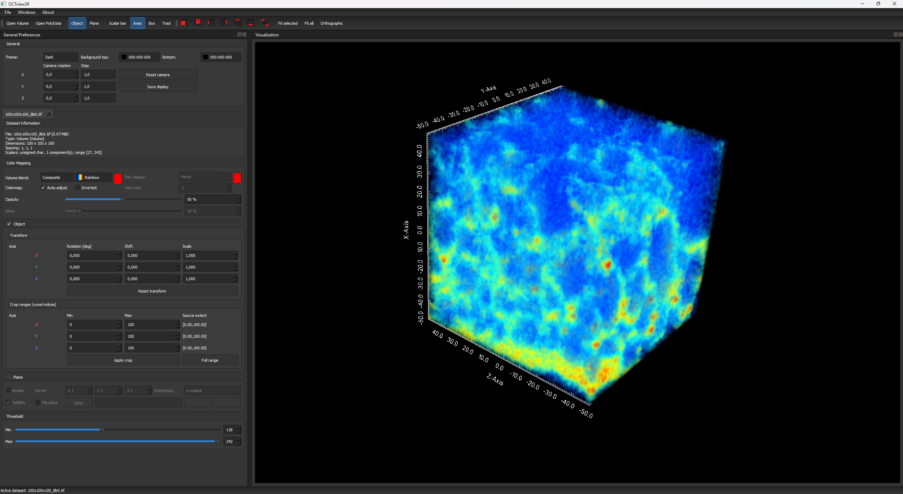

# OCTview3R

OCTview3R is a Windows desktop application for interactive visualization of
volumetric image data and polygonal data sets. It is written in C++ and uses
Qt for the user interface and VTK for data processing and 3D rendering.

The repository contains the application sources, Qt Designer forms, icons,
and a small collection of example data sets. The included TIFF volumes are
OCT scans of an ordinary cherry purchased at a market and contain no human or
clinical data. See [example-data provenance](OCTview3R/ImageData/README.md) for
the exact example files and formats.

## Download for Windows

For use without setting up Qt, VTK, or Visual Studio, open
[GitHub Releases](https://github.com/janlazer/UKE-OCTview3R/releases) and download
`OCTview3R-1.1.0-windows-x64-setup.exe`. The installer includes the required
runtime libraries and Qt plugins. It installs for the current user, provides a
Start menu entry and optional desktop shortcut, and supports uninstalling through
Windows Settings. Administrator rights are normally not required.

Alternatively, extract the complete `OCTview3R-1.1.0-windows-x64-portable.zip`
and run `OCTview3R.exe` from its `OCTview3R` folder. Both downloads require
Windows 10/11 x64, a suitable OpenGL graphics driver, and sufficient memory.
They contain no research datasets and do not change your global PATH.

The installer is currently unsigned; Windows may show a SmartScreen or
unknown-publisher warning. Use only the official release and compare its
SHA-256 checksum with `SHA256SUMS.txt`. Follow your institution's IT policy;
do not disable Windows security. While this repository is private, only
invited collaborators can access releases.

## Screenshots



*Composite volume rendering of the included non-medical cherry OCT data set
with the Rainbow palette. The dark interface shows dataset metadata,
independent palette autoscaling and window/level controls, object transforms,
and crop ranges.*

<p align="center">
  
</p>

<p align="center"><em>The current About dialog with the OCT-volume logo, version, authors, acknowledgements, and licensing.</em></p>

## Features

- Volume rendering for RAW, TIFF, JPEG stack, and legacy VTK image data,
  including grayscale and RGB image stacks
- Polygonal and point-data import for VTK, STL, PLY, VTP, OBJ, BYU (`.g`),
  VTR, and XYZ files; legacy VTK PolyData versions through 5.1 are accepted
- Maximum-intensity, composite, additive, and minimum-intensity blend modes
- Threshold, opacity, window/level, color-transfer, and polygonal gloss controls
- Per-axis range cropping for volume and polygonal data
- Interactive image plane with optional median filtering and clipping
- Multiple data sets in closable, filename-based tabs
- Per-object translation, rotation, and axis scaling
- Editable transform and crop tables with full-range reset
- Camera presets, fit-selected/all, perspective/orthographic projection,
  orientation marker, scalar bar, and cube axes
- Compact dark interface with cyan accents and an independent 3D background
- Self-contained Qt Designer forms for editing the final static interface,
  including styling, spacing, icons, and layout constraints
- Dataset metadata for volume dimensions, spacing, scalar type, mesh bounds,
  and geometry counts
- Automatic surface display and generated normals for polygonal meshes
- Incremental VTK updates for appearance, transform, crop, and plane changes
- TIFF export of the current render window

Window layout, viewer background, camera options, and the
last-used volume and PolyData directories are restored on the next start.

### Grayscale and RGB volumes

OCTview3R automatically selects RGB rendering when a loaded volume contains at
least three scalar components. The **Color mode** control can switch such a
data set between its original RGB colours and a luminance-derived grayscale
view. Single-component data remains in grayscale mode.

In RGB mode, window and level are applied uniformly to the red, green, and blue
channels so that colour relationships are retained. Thresholding is evaluated
from luminance and supplies the volume alpha mask: black and rejected voxels
are transparent in the 3D volume, while accepted voxels retain their RGB
values and follow the opacity control. Slice planes deliberately keep black
image pixels opaque. Composite blending is the recommended mode for
colour-faithful RGB visualization and is selected automatically when an RGB
volume is first loaded; the intensity-projection modes remain available for
exploratory use. Before switching a large RGB volume to grayscale, OCTview3R
checks the estimated working-memory requirement and keeps RGB active with a
warning if the conversion would be unsafe.

### Threshold, palette scaling, and window/level

These controls are independent and stored per dataset:

- **Smooth opacity (Min to Max)** restores intensity-dependent transparency for
  grayscale volumes: opacity rises linearly from zero at Min to the selected
  object opacity at Max. Disable it for uniform opacity and a hard cutoff.
  Source-zero and rejected voxels remain transparent in either mode. This does
  not make slice planes transparent, and RGB retains its binary luminance mask.
- **Autoscale palette** stretches the grayscale or false-colour palette across
  the selected threshold interval. Disable it to keep the full source range as
  the palette reference. This changes colours, not opacity.
- **Auto window (full data range)** sets neutral brightness/contrast using the
  full dataset intensity range. Manual **Window** (contrast) or **Level**
  (brightness) edits disable only Auto window, not Autoscale palette. With
  Autoscale palette enabled, Window/Level acts on the normalized intensities,
  expressed in source-range units; with it disabled, it acts on raw intensities.
  Threshold edits no longer overwrite Window/Level values.

For the earlier soft OCT appearance, enable Smooth opacity, Autoscale palette,
and Auto window. These are the defaults for new grayscale datasets. The
transparency ramp is not spatial smoothing or a segmentation operation: the
threshold interval still excludes values outside Min/Max.

## Requirements

The current project configuration targets the following toolchain:

- Windows x64
- Visual Studio 2022 with the MSVC v143 toolset
- Windows 10 SDK
- Qt 5.15.2 for `msvc2019_64`
- Qt Visual Studio Tools / Qt MSBuild integration
- VTK 8.2.0 built for x64 with Qt and OpenGL support

Qt and VTK must use ABI-compatible compiler and runtime settings.

## Building

1. Clone the repository:

   ```powershell
   git clone https://github.com/janlazer/UKE-OCTview3R.git
   cd UKE-OCTview3R
   ```

2. Configure the dependency paths. The project expects these environment
   variables:

   ```powershell
   $env:VTKDIR = "C:\Programming\VTK\include"
   $env:VTKLIB = "C:\Programming\VTK\lib"
   $env:VTKBIN = "C:\Programming\VTK\bin"
   ```

   The project automatically selects the `Debug` or `Release` subdirectory
   below `VTKLIB` and `VTKBIN`. A configuration-specific directory can also
   be supplied directly. Do not add both VTK runtime configurations to the
   global `PATH`; the project prepends only the active configuration.

   This follows the `UKE-smartLab` dependency layout:

   - `VTKDIR` contains the VTK 8.2.0 headers.
   - `VTKLIB\Debug` and `VTKLIB\Release` contain the matching import libraries.
   - `VTKBIN\Debug` and `VTKBIN\Release` contain the matching runtime DLLs.

3. Open `OCTview3R.sln` in Visual Studio.

4. Select `Release | x64` or `Debug | x64` and build the solution. The selected
   configuration determines which VTK library subdirectory is used.

The Release configuration can also be built from a Visual Studio developer
shell:

```powershell
& "C:\Program Files\Microsoft Visual Studio\2022\Community\MSBuild\Current\Bin\MSBuild.exe" `
  .\OCTview3R.sln `
  /t:Build `
  /p:Configuration=Release `
  /p:Platform=x64 `
  /p:VTKLIB="C:\Programming\VTK\lib"
```

## Running

Use the configuration-aware launcher to avoid mixing Debug and Release DLLs:

```powershell
.\run-viewer.ps1 -Configuration Release
```

The launcher prepends `VTKBIN\<Configuration>` and the Qt DLL directory only
for the child process.

## Deployment

For maintainers: [packaging/README.md](packaging/README.md) documents building,
testing, and publishing the Windows installer and portable release artifacts.

For a portable Release package that can be sent to a colleague as a ZIP, build
Release first, then run:

```powershell
.\deploy-runtime.ps1 -Configuration Release -Standalone
```

This creates `OCTview3R\_standalone` and `OCTview3R\_standalone.zip`, containing
the executable, Qt plugins, VTK DLLs, application-local Visual C++/OpenMP
runtime DLLs, and license notices. Extract the entire archive and start
`OCTview3R.exe`; no separate Qt, VTK, or Visual Studio installation is needed
on Windows 10/11 x64. A suitable graphics driver is still required.
The package contains no research datasets. Generated packages are ignored
by Git. To rebuild, move the previous folder and ZIP first, or supply a fresh
parent directory with `-DestinationRoot`.

Create a deployable runtime directory with Qt plugins and the matching VTK
DLLs:

```powershell
.\deploy-runtime.ps1 -Configuration Release
```

The result is written to `dist\Release`. The same deployment can be invoked as
an MSBuild target:

```powershell
& "C:\Program Files\Microsoft Visual Studio\2022\Community\MSBuild\Current\Bin\MSBuild.exe" `
  .\OCTview3R.sln `
  /t:DeployRuntime `
  /p:Configuration=Release `
  /p:Platform=x64
```

`windeployqt` also places `vc_redist.x64.exe` in the deployment directory.
Install it once on target systems that do not already provide the matching
Microsoft Visual C++ runtime.

## Third-party components

Parts of the dark interface theme are adapted from
[Qt-Frameless-Window-DarkStyle](https://github.com/Jorgen-VikingGod/Qt-Frameless-Window-DarkStyle)
by Juergen Skrotzky and are used under the MIT License. The corresponding
license notice is included in
`OCTview3R/Resources/darkstyle/LICENSE.txt`.

Qt, VTK, the Microsoft runtime, and all components redistributed with a
binary build retain their own licenses. See
[`THIRD_PARTY_NOTICES.md`](THIRD_PARTY_NOTICES.md) for versions, notices, and
source links.

## Example data

The TIFF stacks under `OCTview3R/ImageData` are OCT scans of a cherry. They
are non-medical demonstration data and contain no human, patient, or animal
subject information. Their provenance and exact file list are documented in
[`OCTview3R/ImageData/README.md`](OCTview3R/ImageData/README.md).

VTK-family example files are intentionally not distributed in this
repository. The application continues to support VTK, VTI, VTP, and VTR
input files supplied by users.

## Authors

- **Jan Hahn** — Laser Zentrum Hannover e.V. (LZH; affiliation during
  development) and University Medical Center Hamburg-Eppendorf (UKE; current
  affiliation), [ORCID 0000-0003-3416-636X](https://orcid.org/0000-0003-3416-636X)
- **Giovanno Möbes** — Laser Zentrum Hannover e.V. (LZH; affiliation during
  development)
- **Tammo Ripken** — Laser Zentrum Hannover e.V. (LZH; affiliation during
  development)

OCTview3R was developed privately. The affiliations provide scientific
context and do not designate institutional copyright ownership. Further
information is available in [`AUTHORS.md`](AUTHORS.md).

## Acknowledgements

We thank **Miroslav Zabic** for his advice on preparing OCTview3R for public
release. His independent release test is planned; it is not yet reported as
completed validation.

## Citation

If OCTview3R contributes to published work, please cite the software version
used. GitHub can generate a formatted citation from
[`CITATION.cff`](CITATION.cff). A publication-specific DOI can be added after
the first archived release.

For version 1.1.0, the preferred software citation is:

> Hahn, J., Möbes, G., & Ripken, T. (2026). *OCTview3R* (Version 1.1.0)
> [Computer software]. https://github.com/janlazer/UKE-OCTview3R

Please also cite the associated scientific paper once one has been
published and added to this section.

## Project Structure

See the [architecture and rendering conventions](docs/architecture.md) for the
dataset model, VTK filter chains, coordinate units, transparency rules, and
current test coverage. The [JOSS draft](paper/paper.md) places these design
choices in the scientific literature. The [developer guide](docs/developer-guide.md)
adds a source-reading order, ownership contracts and UI update dependencies.

```text
OCTview3R.sln
run-viewer.ps1             Configuration-safe development launcher
deploy-runtime.ps1         Qt/VTK runtime deployment
OCTview3R/
  OCTview3R.cpp/.h       Main window and UI event handling
  documentModel.cpp/.h   Data-set ownership and active-document selection
  viewerController.cpp/.h Renderer and global viewer decorations
  volumePipeline.cpp/.h  Volume filtering, transfer functions, and planes
  polyPipeline.cpp/.h    Polygonal-data rendering
  transformableImagePlaneWidget.cpp/.h
                         Plane rendering and interaction in object space
  viewerData.h           Per-data-set viewer state and owned VTK objects
  loading.cpp/.h         Background data loading
  legacyVtkCompatibility.cpp/.h
                         VTK 5.1 PolyData compatibility conversion
  opendata.cpp/.h/.ui    Volume-data import dialog
  openpoly.cpp/.h/.ui    Polygonal-data import dialog
  OCTview3R.ui           Main Qt Designer form
  Resources/             Icons and color-map resources
  ImageData/             Market-cherry TIFF/RAW examples and provenance notes
```

## Versioning and releases

OCTview3R follows [Semantic Versioning](https://semver.org/). The first
public release is prepared as **v1.1.0**. Release notes are maintained in
[`CHANGELOG.md`](CHANGELOG.md); packaged binaries should be built from the
matching Git tag so source and executable versions remain traceable.

## Development Status

This is a legacy research codebase with targeted automated pipeline and Qt UI
regression tests. With the build prerequisites above configured, run:

```powershell
.\tests\run-threshold-regression.ps1
```

The tests use synthetic 8-bit, 16-bit, and RGB volumes, check transfer functions
and per-dataset UI state, and save control snapshots under
`tmp/threshold-regression/`. They use separate settings and do not change user
datasets or preferences. Several areas still need broader coverage:

- VTR and other scientific-data imports need broader format coverage tests.
- Tab removal and repeated transform/render operations need regression tests.
- Automated visual comparisons of full rendered volumes are not yet covered.
- A future Qt/VTK upgrade should be handled as a dedicated migration because
  both frameworks have breaking API changes beyond the reference versions.

When adding new functionality, prefer small, testable pipeline components and
VTK smart pointers over additional raw-pointer ownership.

## License

OCTview3R is free software licensed under the
[GNU General Public License version 3 only](LICENSE) (`GPL-3.0-only`). You may
use, study, modify, and redistribute it under those terms. The software is
provided without warranty.

Copyright © Jan Hahn, Giovanno Möbes, Tammo Ripken, and OCTview3R contributors.

Files that carry a separate license notice remain governed by that notice.
See [`THIRD_PARTY_NOTICES.md`](THIRD_PARTY_NOTICES.md) for details.
